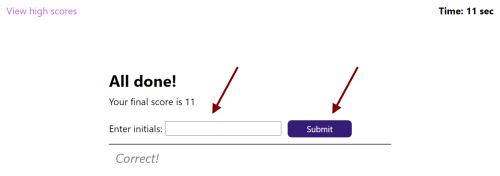

# Quiz Game: JavaScript
## Description
This application can help to check the basic knowledge of JavaScript. This is a practice test, it means that you will see the result as soon as answer the question. It's allowed to take the quiz any number of times.
## Usage
This site was built using [GitHub Pages](https://pages.github.com/). 

Available by link https://olgagav.github.io/quiz/

Open the application by link and click on **Start** button to start the quiz.

You will be asked a question. You have to choose the correct answer.

There is a time limit, 10 sec per each question. Incorrect answer will penaltize your time by ten seconds. If you want to get highest score you should answer correctly as quick as possible. 

Timer stop as soon as you answer all questions or your time reach 0. Time left is your **score**. 

It's allowed to pass this quiz any number of times. You may save your score if add your credentials and click on **Submit** button.

At the end of the quiz you can check the highest score. You can see this page by **View high scores** link at the top of the page as well.

Click **Go back** button to start quiz again.

## Credits
Developed by Olga Gavrushenko.

Learning materials [Berkley Extension: coding bootcamp](https://extension.berkeley.edu/)

## License
n/a 
